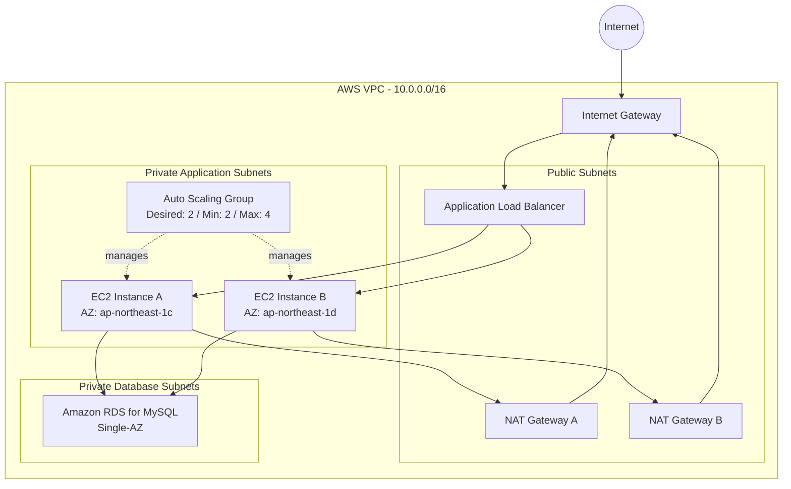

# AWS Production 3-Tier Architecture

```mermaid
flowchart TB
    Internet((Internet))

    subgraph VPC["AWS VPC - 10.0.0.0/16"]
        IGW["Internet Gateway"]

        subgraph Public["Public Subnets"]
            ALB["Application Load Balancer"]
            NAT_A["NAT Gateway A"]
            NAT_B["NAT Gateway B"]
        end

        subgraph App["Private Application Subnets"]
            EC2_A["EC2 Instance A<br/>AZ: ap-northeast-1c"]
            EC2_B["EC2 Instance B<br/>AZ: ap-northeast-1d"]
            ASG["Auto Scaling Group<br/>Desired: 2 / Min: 2 / Max: 4"]
        end

        subgraph Database["Private Database Subnets"]
            RDS["Amazon RDS for MySQL<br/>Single-AZ"]
        end
    end

    Internet --> IGW
    IGW --> ALB
    ALB --> EC2_A
    ALB --> EC2_B
    ASG -. manages .-> EC2_A
    ASG -. manages .-> EC2_B
    EC2_A --> RDS
    EC2_B --> RDS
    EC2_A --> NAT_A
    EC2_B --> NAT_B
    NAT_A --> IGW
    NAT_B --> IGW
```

